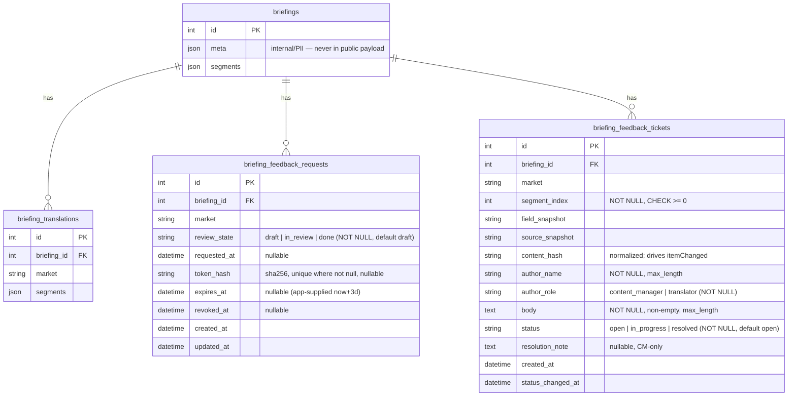
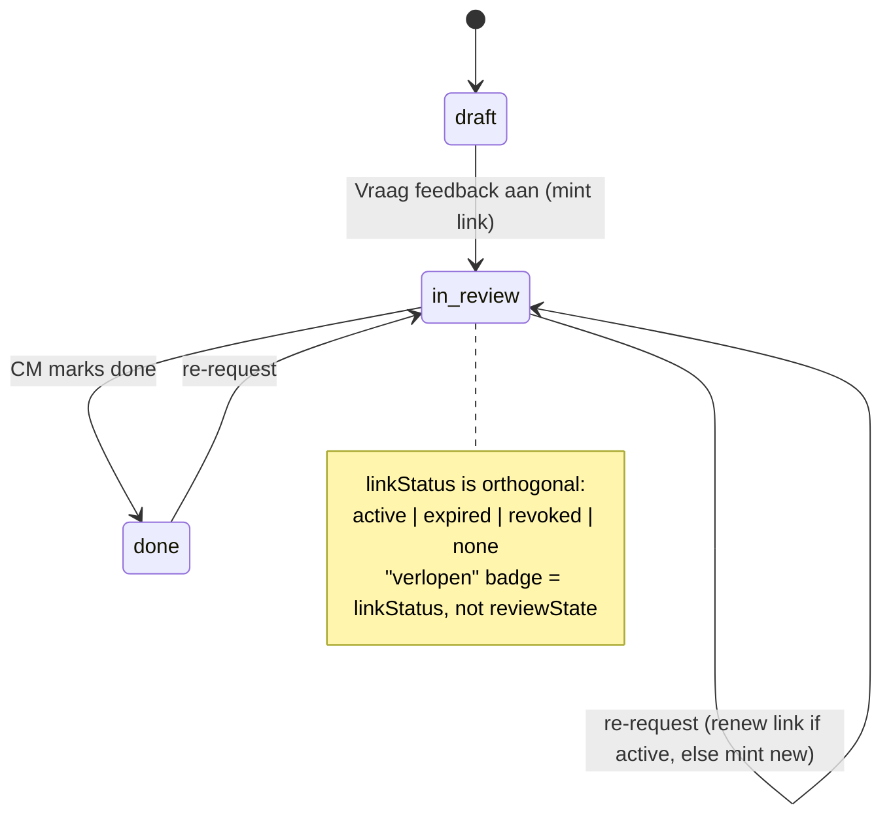

# feat: Translator Feedback Loop (HKM Vertalingen)

## Overview

Add a persisted, per-item feedback loop to the existing Translations feature so a
content manager and a translator can communicate about a campaign's translations
inside the tool — including a **per-market, 3-day, token-based share link** that
lets a translator *without an app account* review and comment on their market via
a public **view-only page**. Feedback is captured as standalone **tickets**
(Open → Opgepakt → Opgelost) per item, with rollup counts, a filter, and
copy/clipboard + `.xlsx` export of clean copy.

This is the "review/approval workflow" already flagged as missing in
`docs/translations-design-brief.md`. The current frontend has an *ephemeral*,
non-persisted per-market approval/comment stub (`saveComment`, `approval`,
client-only `status`) which this work **removes** and replaces with
server-persisted per-market review state + per-item tickets.

## Build Target & Branch Context

- **Build branch:** `feature/hkm-vertalingen` in the handpickedlab fork (decided 2026-06-19). Every assumption in this plan was researched and **re-confirmed against this exact branch**: immutable briefings (`BriefingInputDto` has no `id`; `save_briefing` only creates), no `update_briefing`, ephemeral `approval`/`saveComment` stub in the component, per-router `RoleChecker` auth, `upsert_translation` delete+insert with no `status`/`comment` params.
- **Known divergence (future-merge consideration, NOT built on here):** the sibling branch `feature/vertex-client-project-routing` is 9 commits ahead and has *independently* evolved the same module — it added in-place briefing update (`BriefingInputDto.id` + `BriefingRepository.update_briefing`), persisted per-market `status`/`comment` on `BriefingTranslation` (`upsert_translation(status, comment)`), and a `persist()` flow in the component. Consequences: (a) this plan's durable per-market review state (D2/D3) is **net-new** here, not overlapping; (b) if this feature ever rebases onto / merges with that line, expect conflicts in `briefing_repository.py`, `briefing_service.py`, `briefing_dto.py`, `translations.component.ts`, and a decision on whether this feature's review-state model supersedes or merges with vertex-routing's `status`/`comment`; **re-verify D5/D7 (drift) on any branch where briefings are mutable** — source-segment edits after feedback would then be a live risk, not a non-issue.

## Problem Frame

At HKM, communication between content manager and translator breaks down during
the back-and-forth on translations; questions and change requests scatter across
email/Excel/chat and context is lost (see origin:
`docs/brainstorms/2026-06-18-translator-feedback-loop-requirements.md`). The tool
already produces and exports translations but offers no structured way to request
feedback, discuss specific items, and track resolution — and an external
translator cannot reach the app at all because every route and API call is behind
Firebase/Identity Platform auth.

## Requirements Trace

- R1. Manual briefing creation (block/field/label/char-limit/source text) — *largely exists* (`view='empty'` blank start + `addField`); verify/polish only.
- R2. Per-market "Vraag feedback aan" → generates a per-market link and marks that market **In review** (durable state, see Decision D2).
- R3. Requesting feedback requires a (concept) translation to exist for that market **and** a saved briefing (with an id).
- R4. Feedback = standalone tickets attached to one (market, item); multiple per item.
- R5. Ticket has author name, body, status Open → Opgepakt → Opgelost.
- R6. Content manager manages status; optional note on pick-up/resolve.
- R7. Tickets shared two-way (CM + that market's translator see all tickets on an item).
- R8. Resolved tickets never deleted; collapse under "Opgelost (n)", stay visible for re-review (reopen allowed).
- R9. Counts roll up per item / market / briefing; filter Open / Opgepakt / Opgelost / Alles.
- R10. Per-market token link, bypasses login, **expires 3 days** after creation; expired → clear "verlopen" state.
- R11. View-only page shows source + that market's translation side by side; no editing.
- R12. Translator enters name once (remembered per link); can only create tickets.
- R13. Content manager can copy the link to share manually (no automated email in v1).
- R14. Copy-to-clipboard as TSV (block, field, label, char-limit, source, translation).
- R15. Download clean `.xlsx` (copy only, no feedback) — *reuse existing `/export`*.

## Scope Boundaries

- No automated email/notifications; link shared manually, CM checks counters in-app.
- Translator cannot edit copy — feedback only.
- No internal-only tickets; all tickets on a market are shared. (Ticket `resolution_note`, however, is a CM-only field — see Decision D5.)
- No threaded replies; conversation = separate tickets + optional status notes.
- Exports exclude feedback (copy only).
- Link is per market, not per briefing.
- **Briefings are immutable once saved** (no in-place update endpoint exists; `save` always creates a new id). Editing a briefing and re-saving produces a *new* briefing without the prior feedback — surfaced as a known limitation (see Decision D7), not solved here.
- No request-rate-limiting middleware in v1 (body-size caps ARE in scope; see Risks).
- No new cloud infra; DB migration auto-runs at backend startup.

## Context & Research

### Relevant Code and Patterns

**Backend (`backend/src/translations/`)**
- `schema/briefing_model.py` — `Briefing` (`meta` JSON: email/requestor/date_email/due/notes = internal/PII; `segments` JSON), `BriefingTranslation` (per `(briefing_id, market)`, `segments` JSON, `status` default `"draft"`). Pydantic `_CamelModel` (camelCase), `BaseDocument` response models. **Follow for new tables.**
- `repository/briefing_repository.py` — async SQLAlchemy 2.0; `upsert_translation` **DELETEs+INSERTs** the translation row; `delete_briefing` uses a **Core `delete()`** (no ORM cascade) so briefing-delete cleanup of children depends entirely on **DB-level `ON DELETE CASCADE`**.
- `briefing_service.py` — `save_briefing` **always creates** a new briefing (`BriefingInputDto` has no `id`; no update path); `get_briefing_with_translations(id)` returns **all** markets (do **not** reuse for the public read).
- `briefing_controller.py` — `APIRouter(..., dependencies=[Depends(RoleChecker([ADMIN, USER]))])`; `/export` is `POST {briefing, translations}` → xlsx bytes.
- `briefing_export.py` — `build_briefing_xlsx` (openpyxl), index-aligned, copy only. **R15 already satisfied; reuse.**
- `markets.py` — `MARKETS` dict + `SOURCE_MARKET`; validate `market` against this.
- `auth/auth_guard.py` — `RoleChecker`/`get_current_user` are **router-level** dependencies (no app-wide auth middleware). Omitting them on a router = unauthenticated. **Seam for the public route.**
- `database_migrations.py` + `alembic/versions/` — advisory-lock + `alembic upgrade head` subprocess at startup; **raises** on failure; briefings in `d3e4f5a6b7c8_create_briefings_tables.py` (sole current head). A TCP-healthy boot does **not** prove DDL ran.
- `main.py` — routers via `app.include_router(...)`; `configure_cors` = `allow_origins=["*"]` in dev, `FRONTEND_URL` + `allow_credentials=True` in production; global `@app.exception_handler(Exception)` turns any uncaught error into a generic 500.

**Frontend (`frontend/src/app/`)**
- `app-routing.module.ts` — NgModule routing; `/login` has no guard (precedent for the public route).
- `common/services/auth.guard.service.ts` — redirects to `/login` if not logged in.
- `auth.interceptor.ts` — attaches `Authorization: Bearer <firebase token>` to **every** request and **logs the user out** on token-refresh failure. **Highest-blast-radius change in this plan.**
- `translations/translations.component.ts` (658 lines) — `view`, `workTab`, per-market `mstate` (`status`, `approval`, `texts`), `addField`, `save` (always POST → new id), `exportXlsx`, ephemeral `saveComment`/`approval` (to be **removed**).
- `services/translation.service.ts` — `baseUrl = ${environment.backendURL}/briefings` (`backendURL` ends in `/api`).
- `app.component.ts` / `.html` — `showHeader` toggled on `NavigationEnd` by URL match.
- Known XSS sinks in the repo: `gallery/media-detail` uses `bypassSecurityTrustHtml` + `[innerHTML]`; `shared.module.ts` imports `ngx-markdown` (`<markdown>`). **Translator-supplied text must not flow into these.**

### Institutional Learnings

- `docs/solutions/` not present on this branch.
- Memory (deploy): this is the **handpickedlab fork**; migrations auto-run at startup against the **shared** DB; verify migration success in logs before routing traffic; preview via `--no-traffic --tag` + Firebase Hosting channel.
- Memory (auth): browser reaches Cloud Run only via the Firebase Hosting `/api/**` rewrite (which handles Cloud Run IAM). A public page on the Hosting origin reaches `/api/public/**` without the visitor having IAM; only the app-level Firebase token is bypassed.

### External References

- None required — the token-link pattern (opaque high-entropy token, hashed at rest, expiry, revoke) is standard and grounded in local patterns.

## Key Technical Decisions

- **D1 — Public route = new unauthenticated router.** `public_feedback_controller.py`, prefix `/api/public/feedback`, **no** `RoleChecker`; every route gated by `validate_share_token`. Minimal blast radius (auth is router-level). *The token dependency — not CORS — is the access boundary.*
- **D2 — Durable per-market review state, decoupled from the link.** Review state (`draft → in_review → done`) lives on a per-`(briefing_id, market)` row and **survives link expiry**. The share link is *only* an access credential. *Rationale:* the link is hard-capped at 3 days (R10) but tickets persist (R8); deriving "In review" from an active link would silently drop a market out of review on day 4 while feedback is still open. Display = `{ reviewState, linkStatus: active | expired | revoked | none }`. The "verlopen" badge (R10) comes from `linkStatus`, not `reviewState`.
- **D3 — One per-market record carries both review state and the current link.** To keep the schema to two new tables, `briefing_feedback_requests` is one row per `(briefing_id, market)` (unique) holding `review_state` **and** the current credential (`token_hash`, `expires_at`, `revoked_at`). *Rationale:* unifies durable state + single-active-link without a third table; uniqueness enforces "one active link per market."
- **D4 — Link lifecycle = renew-or-create, single active link, revoke required.** "Vraag feedback aan" while the link is **active** → renew `expires_at = now+3d` on the **same token** (the translator's existing URL keeps working — the common "nudge"/deadline-slip case). While **expired/revoked** → mint a new token (old URL stays dead; CM re-shares). Explicit **revoke** (`DELETE …/share-link`) is **required**, not optional — it is the only lever to kill a leaked URL before its TTL.
- **D5 — Tickets key on `(briefing_id, market, segment_index)`**, never on the `briefing_translations` row (which is delete+inserted on every save). The public/CM ticket models differ: the **public projection excludes `resolution_note`** (a CM-only field) and never carries `briefing.meta`.
- **D6 — Public read uses a dedicated market-scoped service method**, `get_public_view(briefing_id, market)`, returning **only** that market's source+translation+tickets via an explicit **whitelist DTO**. The public controller must **not** call `get_briefing_with_translations` (all markets). Both ticket-create paths (CM + public) route through one shared `feedback_service.create_ticket(...)` differing only by `author_role`, so validation/escaping can't drift.
- **D7 — Drift handling via snapshot + content hash.** Each ticket stores `field_snapshot` + `source_snapshot` (human-readable, for displaying the original context) **and** a normalized `content_hash`. When serving tickets, compare the hash to the current segment; if different, flag `itemChanged: true` so the UI shows "this item changed since the comment." *Rationale:* briefings are immutable once saved, so the real drift vector is **re-translation** (`upsert_translation` replaces a market's `segments` wholesale while index-bound tickets persist), plus the edge of a ticket whose `segment_index` no longer exists. Editing-then-re-saving creates a *new* briefing id and does **not** carry feedback — a known v1 limitation the UI should warn about, not silently drop.
- **D8 — Tokens hashed at rest.** `secrets.token_urlsafe(32)` (256-bit), persist `sha256(token)` in `token_hash` (unique where not null), return raw once; lookup hashes-then-queries by the unique index. `validate_share_token` order: hash → fetch → no row ⇒ raise (404) → `revoked_at` set ⇒ raise → `expires_at <= now` ⇒ raise → return `(briefing_id, market)`. Use **tz-aware** `now` (column is `DateTime(timezone=True)`); **all** rejection paths raise `HTTPException` so the global catch-all never turns a token failure into a 500, and no partial context is returned on the unhappy paths (fail closed).
- **D9 — Frontend auth-bypass via `HttpContext`, not URL matching.** Define a `SKIP_AUTH` `HttpContextToken<boolean>`; the interceptor short-circuits (no header, no logout, pass through) only when the token is set; `public-feedback.service.ts` sets it on its requests. *Rationale:* `url.includes('/public/')` is a security boundary coupled to a naming coincidence — too broad (a future authed URL containing "public" loses its header silently) and invisible at the call site. The context token is explicit, type-checked, and impossible to trigger by URL accident.
- **D10 — Share URL composed on the frontend** from `window.location.origin` + `/feedback/{token}` (preview channels/local dev have different origins; backend `FRONTEND_URL` would be wrong there).

## Open Questions

### Resolved During Planning

- *Serve a public route behind Cloud Run + Firebase auth?* → D1; Hosting `/api` rewrite covers IAM; bypass app-token via D9.
- *Where does "In review" live given upsert wipes status?* → D2/D3 (durable per-market row).
- *Link lifecycle on re-request?* → D4 (renew-or-create, single active, revoke required).
- *Reuse export for R15?* → Yes; `/export` already emits copy-only `.xlsx`.
- *Is manual briefing creation new?* → No; blank + `addField` exist (R1 = verify/polish).
- *Token at rest / fail-closed?* → D8.
- *Interceptor skip mechanism?* → D9 (`HttpContext`, not substring).
- *Segment drift from source edits?* → Largely a non-issue: briefings are immutable once saved (no update path). Real cases handled by D7 (re-translate staleness flag; out-of-range guard; re-save-orphan limitation).

### Deferred to Implementation

- **Request rate-limiting / per-token ticket caps** on the public POST. v1 ships body-size caps + uniform token-error stance; deeper rate-limiting deferred (internal tool) but documented in Risks.
- **Token-in-URL hardening choice**: path token + `Referrer-Policy: no-referrer` + log scrubbing (baseline) vs. carrying the token in the URL **fragment** so it never reaches server logs/`Referer`. Decide during implementation; baseline is mandatory either way (see Risks).
- **Exact grouped-count SQL shape** (`GROUP BY market, status`) — settle against real SQLAlchemy once the model exists.
- **Concurrent-edit protection** (two CMs transitioning one ticket): out of scope for an internal 2-role tool; `status_changed_at` is server-set and last-writer-wins is accepted deliberately.

## High-Level Technical Design

> *This illustrates the intended approach and is directional guidance for review, not implementation specification. The implementing agent should treat it as context, not code to reproduce.*

### Data model (new tables in bold)



All FKs to `briefings.id` use **`ON DELETE CASCADE`** at the constraint level — this is the *only* cleanup path because `delete_briefing` deletes via Core SQL (no ORM cascade). `briefing_feedback_requests` has a **unique** `(briefing_id, market)`.

### Per-market review state (durable; survives link expiry)



### Public token flow

```mermaid
sequenceDiagram
    participant CM as Content Manager (authed)
    participant API as /api/briefings|feedback (RoleChecker)
    participant PUB as /api/public/feedback (no auth, token-gated)
    participant T as Translator (no account)

    CM->>API: POST .../markets/{market}/share-link  (renew-or-create)
    API-->>CM: { token }  (raw, once)
    CM->>T: shares {origin}/feedback/{token} manually
    T->>PUB: GET /public/feedback/{token}
    PUB->>PUB: validate_share_token: sha256 → row → revoked? → expired? (tz-aware) → (briefing_id, market)
    PUB->>PUB: get_public_view(briefing_id, market)  [single market, whitelist DTO, no meta/resolution_note]
    PUB-->>T: briefingName, market, items(source+translation), public tickets
    T->>PUB: POST /public/feedback/{token}/tickets {segmentIndex, authorName, body}
    PUB->>PUB: market/briefing from TOKEN only; segmentIndex range-checked
    PUB-->>T: 201 (author_role=translator, status=open)
    CM->>API: GET /briefings/{id}/feedback (sees ticket + counts + itemChanged flags)
    CM->>API: PATCH /feedback/tickets/{id} {status, note}
```

## Implementation Units

- [ ] **Unit 1: Data model + Alembic migration**

**Goal:** Persist per-market feedback requests (review state + link credential) and tickets.

**Requirements:** R2, R4–R6, R8, R10

**Dependencies:** None

**Files:**
- Create: `backend/src/translations/schema/feedback_model.py` (ORM `FeedbackRequest`, `FeedbackTicket` + Pydantic models)
- Create: `backend/alembic/versions/<rev>_create_feedback_tables.py` (`down_revision` re-pinned to the actual head **at merge time**)
- Test: `backend/tests/translations/test_feedback_model.py`

**Approach:**
- Mirror `briefing_model.py` + `d3e4f5a6b7c8` conventions exactly: every column `nullable`/`server_default`/CHECK explicit.
- `briefing_feedback_requests`: `review_state` NOT NULL `server_default='draft'`; `token_hash` nullable + **unique** (where not null); `expires_at`/`requested_at`/`revoked_at` nullable; `created_at`/`updated_at` NOT NULL `server_default now()`; **unique `(briefing_id, market)`**; FK CASCADE.
- `briefing_feedback_tickets`: `segment_index` NOT NULL `CHECK >= 0`; `body` NOT NULL `CHECK length(btrim(body)) > 0`; `author_name` NOT NULL; `author_role` NOT NULL (no default); `status` NOT NULL `server_default='open'`; `created_at`/`status_changed_at` NOT NULL `server_default now()`; `resolution_note` nullable; index on `(briefing_id, market)`; FK CASCADE.
- Migration is **additive only** (two new tables) → old revisions remain forward-compatible (they ignore the new tables); this is the property that makes startup-migrate-on-shared-DB safe.

**Patterns to follow:** `schema/briefing_model.py`, `versions/d3e4f5a6b7c8_create_briefings_tables.py`.

**Test scenarios:** models validate + camelCase serialize; migration upgrades/downgrades cleanly; unique `(briefing_id, market)` enforced; CHECKs reject negative index / empty body; FK cascade deletes children when a briefing row is removed via Core delete.

**Verification:** locally, `alembic upgrade head` shows `Running upgrade` AND **both tables exist**; `alembic heads` shows a single head; downgrade drops them.

---

- [ ] **Unit 2: Feedback repository + service (review state, links, tickets, counts)**

**Goal:** Data access + domain logic, incl. token hashing, renew-or-create, market-scoped public view, drift flag, grouped counts.

**Requirements:** R2, R3, R4–R10

**Dependencies:** Unit 1

**Files:**
- Create: `backend/src/translations/repository/feedback_repository.py`
- Create: `backend/src/translations/feedback_service.py`
- Create: `backend/src/translations/dto/feedback_dto.py` (CM ticket DTO, status-update DTO, **public create-ticket DTO** `{segmentIndex, authorName, body}` with `max_length` on `authorName`/`body`, **public view DTO** whitelist, per-market overview DTO)
- Test: `backend/tests/translations/test_feedback_service.py`, `backend/tests/translations/test_feedback_repository.py`

**Approach:**
- `request_feedback(briefing_id, market)` (renew-or-create, D4): require saved briefing + a translation for the market (R3); upsert the `(briefing_id, market)` row → `review_state='in_review'`, `requested_at=now`; if active link → renew `expires_at`; else → new token (`secrets.token_urlsafe(32)`, store `sha256`), clear `revoked_at`, set `expires_at=now+SHARE_LINK_TTL_DAYS(=3)`; return raw token once.
- `revoke_link(briefing_id, market)` → set `revoked_at`, clear `token_hash`.
- `validate_share_token(token)` (D8 ordering, tz-aware, fail-closed) → `(briefing_id, market)`.
- `get_public_view(briefing_id, market)` (D6): single market only; whitelist fields; attach public tickets (no `resolution_note`); compute `itemChanged` per ticket via `content_hash` vs current segment.
- `create_ticket(...)` shared by CM + public (author_role differs); `update_ticket_status(ticket_id, status, note)` sets `status_changed_at` server-side only on change; allowed transitions include reopen; reject unknown status (400).
- `get_feedback_overview(briefing_id)` → per market `{ reviewState, linkStatus, tickets[], counts }`; **counts via a single grouped query** (`GROUP BY market, status`).

**Patterns to follow:** `briefing_repository.py`, `briefing_service.py`.

**Test scenarios:** renew-vs-mint on active/expired; token create→resolve roundtrip; expired-by-1s + tz-aware boundary rejected; revoked rejected; unknown token → 404; request blocked when no translation (R3); `get_public_view` returns only its market and excludes `meta`/`resolution_note`; `itemChanged` true after re-translate changes the segment; counts correct; reopen allowed; bad status → 400.

**Verification:** service/repo tests green; tokens never stored in plaintext; public view provably single-market.

---

- [ ] **Unit 3: Authenticated feedback endpoints (content-manager side)**

**Goal:** API for CM to read feedback, create tickets, change status, mint/revoke links.

**Requirements:** R2, R4–R9, R13

**Dependencies:** Unit 2

**Files:**
- Create: `backend/src/translations/feedback_controller.py` (`APIRouter` **with** `RoleChecker([ADMIN, USER])`)
- Modify: `backend/main.py` (register router)
- Test: `backend/tests/translations/test_feedback_controller.py`

**Approach (routes):**
- `GET /briefings/{id}/feedback` → per-market overview.
- `POST /briefings/{id}/feedback/tickets` → CM ticket (shared `create_ticket`, `author_role=content_manager`).
- `PATCH /feedback/tickets/{ticket_id}` → status + optional note.
- `POST /briefings/{id}/markets/{market}/share-link` → `{ token, expiresAt }` (renew-or-create).
- `DELETE /briefings/{id}/markets/{market}/share-link` → **revoke (required)**.

**Patterns to follow:** `briefing_controller.py`.

**Test scenarios:** authed CRUD; 404 unknown briefing/ticket; 400 minting link with no translation; revoke kills token (subsequent public resolve fails); unauthenticated request rejected by the router guard.

**Verification:** endpoints behave under existing auth; revoke is reachable.

---

- [ ] **Unit 4: Public unauthenticated endpoints (translator side)**

**Goal:** Token-gated, market-scoped read + comment for an account-less translator, fail-closed.

**Requirements:** R7, R10, R11, R12

**Dependencies:** Unit 2

**Files:**
- Create: `backend/src/translations/public_feedback_controller.py` (`APIRouter(prefix="/api/public/feedback")`, **no** `RoleChecker`, `Depends(validate_share_token)`)
- Modify: `backend/main.py` (register router)
- Test: `backend/tests/translations/test_public_feedback_controller.py`

**Approach:**
- `(briefing_id, market)` come **only** from `validate_share_token` — never from path/query/body (D5/D6 IDOR invariant).
- `GET /api/public/feedback/{token}` → `get_public_view` (whitelist DTO; single market; no `meta`, no `resolution_note`).
- `POST /api/public/feedback/{token}/tickets` → body `{segmentIndex, authorName, body}` only; `segmentIndex` range-checked against the token's briefing; `author_role=translator`, `status=open`; `max_length` enforced.
- Set `Referrer-Policy: no-referrer` on responses for the public surface; no third-party requests on the page (see Unit 7).

**Execution note:** Start with failing integration tests for the security-critical contract: (a) valid token returns only its market, excluding `meta`/`resolution_note`; (b) expired token → 410; (c) a body attempting to set `market`/`briefingId` is ignored.

**Test scenarios:** valid token → only its market's items+tickets; expired/revoked → 410; unknown → 404; cross-market read/write impossible (token for X yields nothing for Y even when Y has translations); out-of-range `segmentIndex` rejected; POST creates a translator ticket the CM endpoint then sees (R7); no auth header required; a stored `` body comes back as inert text downstream.

**Verification:** unauthenticated GET/POST with a valid token succeed; without/expired/revoked fail closed; no other `/api` path is reachable unauthenticated; no PII/CM-only field in the payload.

---

- [ ] **Unit 5: Frontend services + interceptor opt-out**

**Goal:** Typed clients for CM ticket/share APIs and the public API; stop the auth interceptor from breaking (or insecurely exempting) public calls.

**Requirements:** R2, R4–R14

**Dependencies:** Units 3, 4

**Files:**
- Modify: `frontend/src/app/services/translation.service.ts` (CM methods + interfaces `FeedbackTicket`, `FeedbackOverview`, `ShareLink`)
- Create: `frontend/src/app/services/public-feedback.service.ts` (`getByToken`, `addTicket`; sets `SKIP_AUTH` on every request)
- Modify: `frontend/src/app/auth.interceptor.ts` (define/consume `SKIP_AUTH` `HttpContextToken`; short-circuit when set — no header, no logout)
- Test: `frontend/src/app/auth.interceptor.spec.ts`

**Approach (D9):** the public service is the **only** code path that sets `SKIP_AUTH`. No URL matching anywhere. Public service URL built from `environment.backendURL`.

**Patterns to follow:** `translation.service.ts`.

**Test scenarios:** a request **with** `SKIP_AUTH` carries no `Authorization` and never triggers logout; a normal request (even one whose URL contains "public", e.g. `/briefings?name=public`) **still** gets the token; public-service requests succeed with no session.

**Verification:** with no logged-in user, a public call neither logs out nor attaches a header; no normal request loses its header.

---

- [ ] **Unit 6: Content-manager feedback UI (results view)**

**Goal:** Surface review state, tickets, status management, request/revoke link + copy, TSV clipboard; **remove** the ephemeral stub.

**Requirements:** R2, R4–R9, R13, R14, R15

**Dependencies:** Unit 5

**Files:**
- Modify: `frontend/src/app/translations/translations.component.ts` / `.html` / `.scss`
- Test: `frontend/src/app/translations/translations.component.spec.ts`

**Approach:**
- Bind to the durable per-market `reviewState` + `linkStatus` (D2); **remove** the legacy `approval`/client-`status`/`saveComment` stub so there is one status notion, not two.
- Per item: ticket badge (`n open · n opgepakt · n opgelost`), expandable list, add-ticket, status control (Open → Opgepakt → Opgelost, reopen allowed) with optional note; resolved collapsed under "Opgelost (n)"; show an "item gewijzigd" marker when `itemChanged`.
- Filter bar Open/Opgepakt/Opgelost/Alles; rollup counters per market + per briefing.
- Per market: **"Vraag feedback aan"** → `requestFeedback` → compose `{origin}/feedback/{token}` → copy + toast; show `In review` + expiry/`verlopen` from `linkStatus`; expose **revoke**.
- **Copy to clipboard (TSV)**: build `block\tfield\tlabel\tcharLimit\tsource\ttranslation` rows (escape tabs/newlines in copy); `navigator.clipboard.writeText`.
- Confirm **Download .xlsx** uses existing `exportXlsx` (copy only).
- Render all translator-supplied text (`authorName`, `body`) via interpolation/text binding **only** — no `[innerHTML]`/`bypassSecurityTrust*`/`<markdown>`.
- Warn when editing a briefing that already has feedback (re-save creates a new briefing without it — D7).

**Patterns to follow:** existing `mstate`, `save`, `exportXlsx`; design tokens in `docs/translations-design-brief.md`.

**Test scenarios:** counts render+roll up; filter toggles; status change persists+updates counts; resolved hidden until expanded; `itemChanged` marker shows; request copies a URL; revoke disables the link; TSV columns/escaping correct; ticket body with HTML renders inert.

**Verification:** CM requests a link, sees translator tickets after reload, resolves them, revokes; clipboard pastes cleanly into Excel.

---

- [ ] **Unit 7: Public translator view-only page**

**Goal:** Account-less, read-only page (source + translation per item) where a translator leaves tickets; expired/verlopen state; no app nav; token not leaked.

**Requirements:** R7, R10, R11, R12

**Dependencies:** Unit 5

**Files:**
- Create: `frontend/src/app/translator-feedback/translator-feedback.component.ts` / `.html` / `.scss`
- Modify: `frontend/src/app/app-routing.module.ts` (`{ path: 'feedback/:token', component: TranslatorFeedbackComponent }` — **no** guard)
- Modify: `frontend/src/app/app.module.ts` (declare component)
- Modify: `frontend/src/app/app.component.ts` (hide header when `event.url.startsWith('/feedback/')` — anchored, not `includes`)
- Test: `frontend/src/app/translator-feedback/translator-feedback.component.spec.ts`

**Approach:**
- Read `:token`; call `publicFeedbackService.getByToken`; render per item source + that market's translation side by side, read-only; render translator text via interpolation only.
- Name captured once, stored in `localStorage` keyed by token, reused per ticket.
- Per item: list tickets (both roles) + add-ticket; no status controls, no edit; show "item gewijzigd" when flagged.
- Expired/invalid (410/404) → friendly "deze link is verlopen" state.
- Token-leak hardening: no third-party assets/analytics on this page; rely on `Referrer-Policy: no-referrer`. (If the fragment-token option from Open Questions is chosen, the route reads the token from the URL fragment instead of the path.)
- Standalone layout (no floating nav); match the dark design system.

**Patterns to follow:** `LoginComponent` (guard-less route + nav hidden).

**Test scenarios:** valid token renders only its market read-only; add-ticket posts with stored name; expired → verlopen state; no nav/header; refresh keeps the name; HTML in a ticket renders inert.

**Verification:** opening the link in a fresh incognito session (no login) shows the page and accepts a ticket; CM sees it after reload.

## System-Wide Impact

- **Interaction graph:** new routers registered in `backend/main.py`; new Angular route/component in `app.module.ts`/`app-routing.module.ts`; the `auth.interceptor.ts` change touches **every** HTTP call — mitigated by the explicit `HttpContext` opt-out (D9) so only the public service is exempted, with no URL coincidence risk.
- **Service-boundary risk:** the public read must use the dedicated single-market `get_public_view` and must **not** reach the all-markets `get_briefing_with_translations`; both ticket-create paths share one `create_ticket` so CM/public validation can't drift.
- **Error propagation:** public endpoints fail closed (unknown→404, expired/revoked→410) and all rejection paths raise `HTTPException` so the global catch-all can't downgrade a token failure into a 500; never leak other markets/briefings/meta.
- **State lifecycle risks:** `upsert_translation` delete+insert must not affect requests/tickets (they don't FK the translation row); re-translation can stale a ticket (mitigated by `itemChanged`); editing+re-saving a briefing creates a new id and orphans feedback (D7 limitation + UI warning); briefing-delete cleanup depends on DB `ON DELETE CASCADE` (Core delete, no ORM cascade); migration runs at startup on the shared DB — additive-only keeps old revisions forward-compatible; verify in logs before routing traffic.
- **API surface parity:** every translator action has an authed CM equivalent; the two ticket-create controllers converge on one service method.
- **CORS:** the public route introduces **no** CORS change; `configure_cors` stays as-is; the token (not CORS) is the boundary — *do not widen `allow_origins`/`allow_credentials` for the link* (explicit non-goal).
- **Integration coverage:** the cross-auth-boundary path (mint link → open unauthenticated → post ticket → CM sees + resolves → revoke) won't be proven by unit tests alone — exercise manually via `docker compose up` (only auto-translate needs Vertex; the whole feedback flow runs on local Postgres).

## Risks & Dependencies

- **Public-route data exposure (highest).** Mitigations: dedicated prefix + token dependency on every route (D1), market-scoped whitelist DTO excluding `meta`/`resolution_note` (D6), IDOR invariant — token is the sole selector (D5), fail-closed ordering (D8), and the cross-market/PII fail-closed tests in Unit 4.
- **Auth-bypass blast radius (interceptor).** Mitigated by the `HttpContext` opt-out (D9) instead of URL matching; Unit 5 asserts no normal request loses its header and no "public"-named URL is exempted.
- **Stored XSS into the privileged CM session.** Translator text rendered interpolation-only; `[innerHTML]`/`bypassSecurityTrust*`/`<markdown>` forbidden for these fields (Units 4/6/7); server-side `max_length` caps.
- **Token-in-URL exposure (3-day shareable URL).** Baseline mandatory: `Referrer-Policy: no-referrer`, no third-party requests/analytics on the public page, scrub the token from backend access logs for `/api/public/feedback/*`, and ship **revoke** (D4). Optional stronger: token in URL fragment (Open Questions).
- **Abuse on the unauthenticated POST.** v1 ships body-size caps + uniform token-error stance (no reason-revealing error bodies); request-rate-limiting deferred and documented.
- **Migration on the shared DB.** Re-pin `down_revision` to the real head at merge; pre-merge `alembic heads` must show one head; additive-only keeps old revisions compatible; confirm `Running upgrade` + both tables exist in logs before routing traffic (TCP-healthy boot ≠ migrated). Follow the fork's `--no-traffic --tag` + Hosting preview-channel pattern.
- **Concurrency.** Last-writer-wins on ticket status accepted for an internal 2-role tool; `status_changed_at` is server-set.
- **Drift.** `itemChanged` flags stale tickets after re-translation; re-save-orphaning is a documented v1 limitation.

## Documentation / Operational Notes

- Note the new public route in any internal runbook: it is the **only** unauthenticated `/api/**` surface; the token is the access boundary.
- No new secrets/infra. Local test via `docker compose up` (needs `backend/.env`).
- Operational lever: a leaked link is killed via the revoke endpoint (Unit 3) before its 3-day TTL.

## Sources & References

- **Origin document:** [docs/brainstorms/2026-06-18-translator-feedback-loop-requirements.md](../brainstorms/2026-06-18-translator-feedback-loop-requirements.md)
- Design system: `docs/translations-design-brief.md`
- Backend: `backend/src/translations/`, `backend/src/auth/auth_guard.py`, `backend/src/database_migrations.py`, `backend/main.py`, `backend/alembic/versions/d3e4f5a6b7c8_create_briefings_tables.py`
- Frontend: `frontend/src/app/app-routing.module.ts`, `auth.interceptor.ts`, `translations/translations.component.ts`, `services/translation.service.ts`, `app.component.ts`
