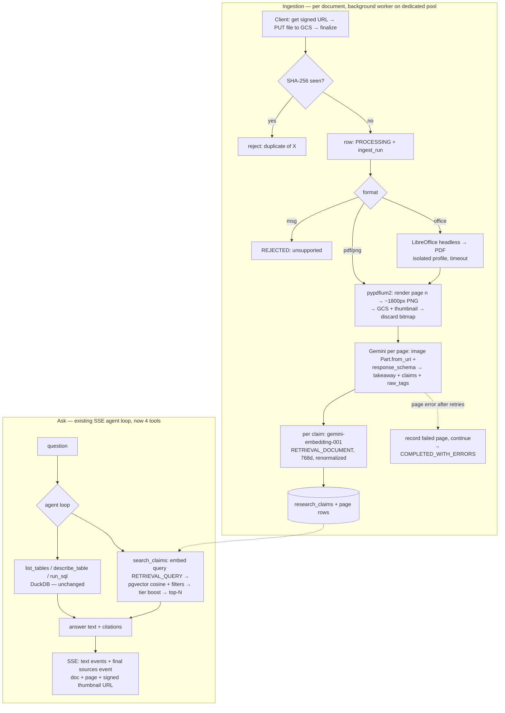

# feat: Market Research Document Library

## Overview

Extend the market-research PoC (`backend/src/data_query`) with a **global
document library**: ~150 chart-heavy research documents (PDF/DOCX/PPT/PPTX/ODP)
are converted → rendered to page images → run through per-page multimodal
Gemini extraction into **atomic insight claims** with embeddings, stored in
Postgres (pgvector). The existing DuckDB ask-agent gains a fourth tool
(`search_claims`) so one question can combine deck facts and exact spreadsheet
math, with per-document priority tiers, slide-image citations, and conflict
surfacing across editions.

## Problem Frame

The current `data_query` feature only accepts CSV/XLSX into DuckDB. The client
supplied a folder of **151 research documents (~6,500 pages)** — trend reports
and monitors from Euromonitor, Kantar, McKinsey, Statista, Ipsos, Thuiswinkel,
NIQ, etc. A corpus survey (2026-07-06, see
`docs/brainstorms/2026-07-06-market-research-corpus-inventory.json`) shows why
text-based approaches are dead on arrival: **79 of 127 PDFs have no extractable
text layer at all** (13 more are poor) — they are effectively images. Page-as-
image multimodal extraction is the only approach that works on this corpus.
Full context and product decisions: see origin doc.

### Corpus profile (drives sizing throughout this plan)

| Dimension | Reality |
|---|---|
| Files / pages | 151 files, ~6,499 pages (median 34 p., p90 87 p., max 700 p.) |
| Formats | 127 PDF, 8 DOCX, 4 PPTX, 3 PPT, 6 MSG, 1 ODP, 1 XLSX, 1 PNG |
| Kinds | 92 slide decks, 44 prose reports, 8 infographics, 6 emails, 1 table set |
| Text layer (PDF) | 79 none / 13 poor / 35 good |
| Languages | 105 EN, 35 NL, 4 DE |
| Chart density | 70 high, 54 medium, 27 low |
| Duplicates | 17 exact/near pairs |

## Requirements Trace

- R1. Upload PDF/DOCX/PPT/PPTX/ODP/PNG into a global library; office→PDF
  conversion; MSG rejected visibly; XLSX/CSV keep routing to DuckDB → Units 1, 2, 6
- R2. Page → image → multimodal extraction into atomic claims linked to
  document + slide + slide image → Units 2, 3
- R3. Claims semantically searchable (embeddings + tag/metadata filters) → Units 3, 4, 5
- R4. Hybrid agent: claim search + DuckDB SQL in one answer → Unit 5
- R5. Citations: document + slide number, original slide image viewable → Units 5, 7
- R6. Conflicting claims surfaced (recency from claim `period`, not upload date) → Unit 5
- R7. Priority tier per document, defaults by kind, adjustable, weighs into ranking → Units 1, 5, 6
- R8. Library view: status, tier, delete, re-process → Units 1, 6
- R9. Exact-duplicate detection at upload; near-duplicates flagged → Units 1, 6
- Success criteria (origin doc) validated end-to-end → Unit 8

## Scope Boundaries

- Global library only — no workspace scoping/permissions (PoC).
- No knowledge-graph DB; no standalone insight-browsing UI; no deep-research
  integration; no document versioning; no persisted chat history (the ask flow
  stays stateless).
- MSG e-mail files rejected in v1.
- Vertex Batch Prediction API for extraction is a *deferred cost optimization*
  (~50% cheaper) — v1 uses online calls with bounded concurrency.

## Context & Research

### Relevant Code and Patterns (this repo)

- `backend/src/brand_guidelines/brand_guideline_service.py` — THE pattern to
  mirror: GCS v4 signed-URL upload (`generate-upload-url` → client PUT →
  `finalize-upload`), placeholder row + `JobStatusEnum`, module-level worker
  submitted to an executor, `WorkerDatabase()` per-thread engine, Gemini call
  with `response_mime_type="application/json"` + `response_schema`.
- `backend/src/data_query/agent.py` — hand-rolled Gemini function-calling loop
  (`_TOOLS` dict list → `types.FunctionDeclaration`, `_dispatch`, module-level
  `SYSTEM` prompt, `MAX_STEPS=12`), yields SSE events `{"t": "tool"|"tool_result"|"text"}`.
  Natural extension point for `search_claims`.
- `backend/src/data_query/duckdb_store.py` — sheet warehouse; unchanged.
- `backend/src/source_assets/source_asset_service.py` — existing SHA-256
  `find_by_hash` dedupe pattern (reuse the approach, own table).
- `backend/src/common/storage_service.py::GcsService` — upload/download/delete;
  GCS keying convention `{feature}/{scope-or-'global'}/{uuid}/{filename}`.
- `backend/src/auth/iam_signer_credentials_service.py` — v4 signed URLs via IAM
  `sign_blob` (no local private key).
- `backend/src/deep_research/agent/config.py` — env-var-per-role model config
  pattern (`DR_*`); copy as `RL_*` for extraction/embedding/canonicalization.
- `backend/src/common/schema/genai_model_setup.py` +
  `backend/src/common/vertex_credentials.py` — the ONLY correct way to build
  genai clients (inherits `VERTEX_PROJECT_ID`/`VERTEX_CREDENTIALS_FILE` routing
  to `pj-hkm-design-genai`).
- Model/DTO/repository conventions: `schema/<name>_model.py` (SQLAlchemy Base +
  Pydantic `BaseDocument`, camelCase aliases), `repository/` subclassing
  `BaseRepository`, DI via `Depends()`, router registered in `backend/main.py`.
  NB: `data_query`'s bare-`BaseModel` DTO style is the outlier — new persisted
  entities follow the house style.
- `backend/src/common/media_utils.py` — subprocess pattern (`subprocess.run` +
  `FileNotFoundError`/`CalledProcessError` handling) for shelling out (ffmpeg
  today, LibreOffice tomorrow).
- Frontend: `frontend/src/app/data-query/data-query.component.ts` (+ `.html`)
  and `frontend/src/app/services/data-query.service.ts` — bespoke SSE-over-
  HttpClient parser; `ngx-markdown` 18 already a dependency (used in
  deep-research) but data-query still renders raw text; brand-guideline
  polling pattern in `common/services/brand-guideline/brand-guideline.service.ts`.

### Institutional Learnings

- `docs/plans/2026-06-18-001-feat-translator-feedback-loop-plan.md`: Alembic
  migrations must be **additive-only** (auto-run at startup; old revisions must
  stay forward-compatible); re-pin `down_revision` to the actual head at merge;
  FK cascades at DB-constraint level; a TCP-healthy Cloud Run boot does not
  prove migrations ran.
- New tables need the model imported in `backend/alembic/env.py` or
  `Base.metadata` misses them.
- Backend tests: `uv sync --extra dev`; async tests need `@pytest.mark.anyio`.
- Deploys: BuildKit-dependent Dockerfile → `cloudbuild` config with
  `DOCKER_BUILDKIT=1`; manual `--no-traffic --tag` then `update-traffic`.
- The Vertex SA in the client project (`pj-hkm-design-genai`) has lost
  `roles/aiplatform.user` multiple times (client-side IAM changes) → the bulk
  ingest must fail fast with a clear error on 403, and cross-project GCS access
  from Vertex-side operations has bitten before (Veo) — page images live in
  *our* bucket and are passed by `gs://` URI, so verify read access early.

### External References (full write-ups in research transcripts)

- **pypdfium2** (Apache-2.0/BSD-3) for rendering; PyMuPDF ruled out (AGPL —
  network-use clause is a real risk for closed-source SaaS). Open by file path
  (lazy loading), render→encode→upload→discard per page; target **long-edge
  ~1536–2048px** (not fixed DPI — corpus mixes A4 prose and 16:9 slides);
  Gemini tiles at 768×768 = 258 tokens/tile, so ~6 tiles ≈ 1.5k tokens/page.
- **LibreOffice headless** is the only credible DOCX+PPTX+ODP→PDF path.
  Minimal set: `libreoffice-core`, `libreoffice-writer`, `libreoffice-impress`,
  `fonts-crosextra-carlito`, `fonts-crosextra-caladea` (metric-compatible
  Calibri/Cambria substitutes — without them slide layouts reflow),
  `fonts-liberation`, `fonts-noto`. Per-invocation isolated profile dir
  (`-env:UserInstallation=file:///tmp/lo-<uuid>`), flags `--headless --nologo
  --nodefault --norestore --nolockcheck`, hard subprocess timeout, one retry
  with a fresh profile. (~15 office files total → subprocess-per-file is fine;
  unoserver not needed.)
- **Extraction**: one page per call (provenance, retry granularity, documented
  multi-image degradation); `response_schema` reliable incl. arrays of nested
  objects, but complex schemas can 400 — keep it flat, no
  `additionalProperties`, validate with Pydantic anyway; widen SDK retries
  (`HttpRetryOptions`, attempts≈8, 408/429/5xx) and consider `location="global"`
  for the extraction client to dodge regional 429s (note: differs from the
  app-wide `LOCATION` config — confirm compatibility at implementation).
- **Embeddings**: `gemini-embedding-001` — explicitly supports NL+EN+DE (105
  EN / 35 NL / 4 DE corpus). `text-embedding-005` is English-only: ruled out.
  `task_type=RETRIEVAL_DOCUMENT` for claims, `RETRIEVAL_QUERY` for questions;
  `output_dimensionality=768` (MRL truncation → **re-normalize vectors**).
  **Gotcha: one embedding per API call** (no request batching yet; multiple
  `contents` collapse into ONE embedding) → ~20–40k sequential-ish calls for
  the corpus; cost negligible (<$0.50 total).
  The legacy `vertexai.language_models.TextEmbeddingModel` is past its removal
  date — do not use.
- **Vector search**: pgvector on Cloud SQL, plain sequential scan with `<=>`
  cosine — no HNSW/IVF at 20–40k rows. In-memory numpy ruled out because Cloud
  Run's ephemeral multi-instance model makes load-at-startup the wrong shape.
- **Cost estimate** (~6.5k pages, ~1.8k input tokens + ~600 output tokens per
  page): Flash ≈ **$13–20**, Pro ≈ **$55–85** one-time online; Batch API would
  halve it. Embeddings < $0.50. Dedupe (17 pairs) trims ~5–10%.
- **Model lifecycle flag**: `gemini-2.5-flash`/`-pro` retire **2026-10-16** —
  all model IDs must be env config so the swap is config-only.

## Key Technical Decisions

- **New module `backend/src/research_library/`**, not more code inside
  `data_query`: ingestion/claims/canonicalization are a coherent domain;
  `data_query` only gains one tool + service dependency. Follows the house
  module layout (controller/service/schema/repository/dto).
- **Storage: Postgres + pgvector** (`CREATE EXTENSION IF NOT EXISTS vector` in
  the migration; `pgvector` Python package for the SQLAlchemy `Vector` type).
  Claims and embeddings are durable — re-extraction of the corpus costs real
  money; the local-DuckDB-style ephemerality of `data_query` is not acceptable
  here. DuckDB stays the sheet warehouse (unchanged).
- **Page-as-image extraction, one page per call**, `gemini-2.5-pro` default
  (chart accuracy is the bottleneck; absolute cost < $100), model + concurrency
  + resolution env-tunable via `RL_*` config module. Page images uploaded to
  GCS first, passed as `Part.from_uri` (house pattern; avoids base64 inflation).
- **Extraction output per page**: slide takeaway + claims[] {statement (source
  language), metric, value, unit, segment, geography, period, claim_type
  (measurement|forecast), source_citation, sample, raw_tags[]} — dimensions
  NEVER inside metric names (origin doc decision). Tags/metrics canonicalized
  in English; statements stay in source language (multilingual embeddings make
  cross-language retrieval work).
- **Dedicated ingest executor** (own `ThreadPoolExecutor`, size via `RL_INGEST_WORKERS`),
  NOT the shared `app.state.executor` (max_workers=4) — a 151-document bulk
  run must not starve video/brand-guideline jobs.
- **Per-page bookkeeping + `COMPLETED_WITH_ERRORS`**: page-level status rows so
  a failure at page 57/120 keeps pages 1–56 and retries only failures.
  Extend/augment the status handling rather than silently reusing the 4-state
  `JobStatusEnum` (which has no partial state).
- **Exact-dupe rejection by SHA-256 at finalize** (computed on the GCS object),
  mirroring `source_assets.find_by_hash`; near-duplicates only flagged in the
  library UI.
- **Reprocess = atomic swap**: new extraction written under a new `ingest_run_id`,
  visible claims switched only on success, old run's claims then deleted.
  Delete-while-processing guarded by a tombstone check before the worker's
  terminal write.
- **Hybrid agent = extend the existing loop** in `data_query/agent.py` (4th
  tool `search_claims`), not ADK. SSE vocabulary gains a `sources` event with
  structured citations; the FE parser already handles typed events.
- **Tier ranking**: tier (primary/supporting/background) stored per document,
  defaults by detected kind (slide-deck → primary), applied as a score
  multiplier on cosine similarity *after* hard filters, plus a SYSTEM-prompt
  instruction; recency for conflicts comes from claim `period`.
- **Tag canonicalization** per origin doc: raw tags permanent on claims;
  `tag_aliases` (raw → canonical) rebuilt by an admin bootstrap endpoint
  (embed distinct raw tags → agglomerative cosine clustering → LLM names each
  cluster); **re-running re-resolves canonical tags for ALL existing claims**
  (batch UPDATE via the mapping — no LLM re-extraction). Ongoing ingests get
  the canonical vocabulary in the extraction prompt; unseen tags embedding-
  matched (≥ threshold → auto-alias, else new candidate, auto-accepted in PoC).
  No review UI: bootstrap returns a reviewable summary; fixes via simple admin
  endpoints.

## Open Questions

### Resolved During Planning

- Claims/embeddings storage → pgvector on Cloud SQL (see decisions).
- Office formats → LibreOffice headless in the backend image (see decisions).
- Agent loop → extend existing hand-rolled loop, not ADK.
- Model tier → Pro default, env-swappable; online API for v1, Batch API deferred.
- Embedding model → `gemini-embedding-001`, 768 dims, task-typed.
- MSG/PNG/XLSX scope → per updated origin doc (reject / ingest / route to DuckDB).
- Chat history → stays stateless (PoC); citation viewing lives within an answer.
- Human tag review → one-time bootstrap summary reviewed by hand (Niek/Astrid),
  no dedicated tooling in v1.

### Deferred to Implementation

- pgvector availability on the actual Cloud SQL instance: `CREATE EXTENSION`
  requires it to be allowlisted — **verify in Unit 1 before anything else**;
  fallback is a float8[] column + Python-side cosine (small code seam in the
  repository layer either way).
- Test strategy for the vector column given the aiosqlite-based test setup —
  likely: repository-level fakes in service tests + a thin integration test
  guarded to Postgres.
- Exact clustering/alias thresholds for canonicalization (tune on the real
  distinct-tag set during the bootstrap run).
- Slide-image render resolution fine-tuning (start ~1800px long edge, adjust
  after eyeballing extraction quality vs. token cost on sample decks).
- Whether `location="global"` for the extraction client conflicts with the
  existing client setup (regional `LOCATION` config) — fallback: keep regional
  + wider retries.
- The 700-page Euromonitor Passport monster: page cap per document
  (`RL_MAX_PAGES`, default e.g. 250) with visible truncation note, or manual
  tier-down — decide when ingesting it.

## High-Level Technical Design

> *This illustrates the intended approach and is directional guidance for
> review, not implementation specification. The implementing agent should
> treat it as context, not code to reproduce.*

## Implementation Units

- [x] **Unit 1: research_library module foundation (schema, migration, CRUD API)**

**Goal:** The library exists: documents can be registered via signed-URL upload
flow, listed with status/tier, tier-patched, deleted; claims/pages tables ready.

**Requirements:** R1, R7, R8, R9

**Dependencies:** None. *First action: verify pgvector `CREATE EXTENSION` works
on the Cloud SQL instance and locally.*

**Files:**
- Create: `backend/src/research_library/research_library_controller.py`,
  `research_library_service.py`, `schema/research_document_model.py`,
  `schema/research_claim_model.py` (claims + pages + tag_aliases tables),
  `repository/research_document_repository.py`,
  `repository/research_claim_repository.py`, `dto/research_library_dto.py`,
  `config.py` (`RL_*` env pattern)
- Create: `backend/alembic/versions/<hash>_add_research_library_tables.py`
- Modify: `backend/main.py` (router + dedicated ingest executor),
  `backend/alembic/env.py` (model imports), `backend/pyproject.toml` (`pgvector`)
- Test: `backend/tests/research_library/test_research_library_service.py`

**Approach:**
- Tables: `research_documents` (id, filename, mime, sha256 UNIQUE, gcs_uri,
  kind, language, year/period, priority_tier, status, error_message,
  page_count, failed_pages, ingest_run_id, timestamps, soft-delete),
  `research_document_pages` (document_id FK CASCADE, page_no, image_gcs_uri,
  thumb_gcs_uri, status, error), `research_claims` (document_id FK CASCADE,
  page_no, statement, metric, value, unit, segment, geography, period,
  claim_type, source_citation, sample, raw_tags JSONB, canonical_tags JSONB,
  embedding vector(768), ingest_run_id), `tag_aliases` (raw UNIQUE → canonical, kind: tag|metric).
- Endpoints mirror brand_guidelines: `POST /generate-upload-url`,
  `POST /finalize-upload` (sha256 dedupe check → REJECTED-with-reason or
  PROCESSING row + worker submit), `GET /documents` (paginated, incl. status +
  tier + duplicate-flag), `PATCH /documents/{id}` (tier), `DELETE /documents/{id}`
  (soft delete + tombstone), `POST /documents/{id}/reprocess`.
- MSG (and other unsupported) MIME/extensions → visible REJECTED status with
  reason, never silent skip. Migration is additive-only; re-pin down_revision at merge.

**Patterns to follow:** `brand_guidelines` module end-to-end; `BaseDocument`
camelCase models; `source_assets` hash-dedupe approach.

**Test scenarios:** duplicate sha256 → rejected with pointer to existing doc;
MSG upload → REJECTED + reason; tier defaults by kind and PATCH persists;
delete sets tombstone; unsupported vs supported MIME validation on
generate-upload-url.

**Verification:** migration runs from clean DB and from current head; vector
column accepts a 768-float row on real Postgres; CRUD endpoints exercised via
FastAPI test client.

- [x] **Unit 2: conversion + page rendering pipeline**

**Goal:** Any accepted document becomes a normalized sequence of page images
(+ thumbnails) in GCS.

**Requirements:** R1, R2

**Dependencies:** Unit 1

**Files:**
- Create: `backend/src/research_library/ingest/conversion_service.py`
  (LibreOffice), `backend/src/research_library/ingest/rendering_service.py`
  (pypdfium2 + Pillow thumbnails)
- Modify: `backend/Dockerfile` (libreoffice-core/writer/impress +
  fonts-crosextra-carlito/caladea + fonts-liberation + fonts-noto),
  `backend/pyproject.toml` (`pypdfium2`)
- Test: `backend/tests/research_library/test_rendering_service.py`,
  `test_conversion_service.py`

**Approach:**
- LibreOffice via subprocess (media_utils pattern): isolated
  `-env:UserInstallation` per invocation, hard timeout (~120s), one retry with
  fresh profile; DOCX/PPT/PPTX/ODP → PDF; PNG/JPEG skip conversion (single
  "page").
- pypdfium2: open by *path* (lazy), per page render→encode PNG→upload→discard;
  long-edge target `RL_RENDER_LONG_EDGE` (default ~1800px); thumbnail ~400px.
  GCS keys: `research-library/global/{doc_uuid}/pages/{n}.png` (+ `thumbs/`).
- Respect `RL_MAX_PAGES` cap with visible truncation note on the document row.

**Execution note:** Verify LibreOffice conversion fidelity manually on 2–3 real
corpus files (fonts!) before wiring the rest; Docker image size delta is
expected (~300MB) — build once early.

**Test scenarios:** landscape deck vs portrait A4 both hit long-edge target;
corrupt PDF → clean per-document failure; conversion timeout → retried once
then failed with reason; PNG input produces exactly one page.

**Verification:** a real corpus PPT and DOCX convert and render locally;
rendered slide is visually legible at target resolution.

- [x] **Unit 3: claim extraction + embeddings + background worker**

**Goal:** A finalized document ends at COMPLETED (or COMPLETED_WITH_ERRORS)
with claims + embeddings queryable in Postgres.

**Requirements:** R2, R3

**Dependencies:** Units 1, 2

**Files:**
- Create: `backend/src/research_library/ingest/extraction_service.py`,
  `backend/src/research_library/ingest/ingest_worker.py`,
  `backend/src/research_library/ingest/embedding_service.py`
- Test: `backend/tests/research_library/test_extraction_service.py`,
  `test_ingest_worker.py`

**Approach:**
- Worker: module-level function on the **dedicated** executor, own event loop +
  `WorkerDatabase()` (brand_guidelines pattern); pipeline per document:
  convert → render → per-page extract → per-claim embed → persist; per-page
  status rows; page-level retry (2×, widened `HttpRetryOptions` on the client);
  tombstone check before terminal write; final status COMPLETED /
  COMPLETED_WITH_ERRORS (+failed_pages) / FAILED.
- Extraction call: image `Part.from_uri(gs://...)` + flat `response_schema`
  (takeaway + claims array, no additionalProperties) + Pydantic validation +
  one retry with simplified schema on 400; prompt includes: dimensions never in
  metric names, canonical vocabulary (once it exists), source-footnote capture,
  `claim_type` measurement vs forecast. Model `RL_EXTRACT_MODEL`
  (default `gemini-2.5-pro`), concurrency `RL_EXTRACT_CONCURRENCY` (default ~4).
- Embeddings: one call per claim (`gemini-embedding-001` gotcha),
  `RETRIEVAL_DOCUMENT`, `output_dimensionality=768`, renormalize; clients built
  via `GenAIModelSetup` so Vertex routing/credentials are inherited; fail fast
  with a clear message on 403 (known SA-IAM regression).

**Test scenarios:** page 57 fails after retries → 56 pages of claims kept +
COMPLETED_WITH_ERRORS; delete-during-processing → worker aborts without
resurrecting the row; schema-mismatch response → validation retry path;
embeddings renormalized (unit norm); Gemini mocked per `tests/multimodal/test_gemini_service.py` pattern.

**Verification:** one real slide-deck PDF ingests end-to-end locally against
real Vertex; spot-check claims of a known slide (e.g. Thuiswinkel "46% smartphone
2030") for correct metric/value/segment/period/source.

- [x] **Unit 4: tag & metric canonicalization**

**Goal:** Cross-deck filters actually work: raw tags/metrics map to a canonical
vocabulary, rebuildable at any time without re-extraction.

**Requirements:** R3

**Dependencies:** Unit 3

**Files:**
- Create: `backend/src/research_library/canonicalization_service.py`
- Modify: `research_library_controller.py` (admin endpoints:
  `POST /canonicalize/bootstrap`, `GET /tags`, `PATCH /tags` for manual fixes),
  `extraction_service.py` (vocabulary into prompt; embedding auto-alias for
  unseen tags at write time)
- Test: `backend/tests/research_library/test_canonicalization_service.py`

**Approach:**
- Bootstrap: distinct raw tags/metrics → embed → agglomerative clustering on
  cosine threshold (tunable) → one LLM call per cluster names canonical EN tag →
  write `tag_aliases` → **batch-update `canonical_tags` on ALL claims** (the
  re-resolve step that keeps old claims searchable after every re-run).
  Returns a human-reviewable summary (cluster → members → chosen name).
- Ongoing: unseen raw tag → embedding match vs canonical set; ≥ threshold →
  auto-alias, else new canonical candidate (auto-accepted, PoC).

**Test scenarios:** re-run with changed mapping updates existing claims'
canonical_tags; near-synonyms cluster ("smartphone"/"m-commerce"); distinct
concepts don't; idempotent re-run on unchanged corpus.

**Verification:** bootstrap on the real corpus yields a reviewable list of
~50–150 canonical tags; a canonical-tag filter returns claims from multiple
publishers.

- [x] **Unit 5: search_claims service + hybrid agent + citations protocol**

**Goal:** One question can combine deck facts and DuckDB math; every deck fact
carries a document+page citation the frontend can render.

**Requirements:** R3, R4, R5, R6, R7

**Dependencies:** Units 1, 3 (4 improves quality but isn't blocking)

**Files:**
- Create: `backend/src/research_library/search/claim_search_service.py`
- Modify: `backend/src/data_query/agent.py` (add `search_claims` to
  `_TOOLS`/`_dispatch`, extend `SYSTEM`), `backend/src/data_query/data_query_service.py`
  (inject search service), `backend/src/data_query/dto/data_query_dto.py`
  (optional `allowed_documents`), `backend/src/data_query/data_query_controller.py`
- Test: `backend/tests/data_query/test_agent_hybrid.py`,
  `backend/tests/research_library/test_claim_search_service.py`

**Approach:**
- `search_claims(query, tags?, period?, language?, publisher?)`: embed query
  (`RETRIEVAL_QUERY`) → pgvector `<=>` cosine over non-deleted claims → hard
  filters first (incl. server-side `allowed_documents` mirror of the
  `allowed_tables` defense) → tier multiplier (e.g. primary 1.0 / supporting
  0.85 / background 0.7, env-tunable) → top-N with {statement, metric, value,
  period, source_citation, document, page_no, claim_id}.
- SYSTEM additions: prefer higher-tier sources; on conflicting claims for the
  same metric+segment, name both values with periods and prefer the most recent
  `period`; cite every deck fact as [doc, page]; if one tool returns nothing,
  try the other before concluding no data; answer in the user's language.
- SSE: stream unchanged `text` events; emit a final `{"t":"sources", ...}`
  event mapping citation markers → {document, page, thumbnail URL (signed or
  streamed via a small `GET /documents/{id}/pages/{n}/image` endpoint)}.
  Tier-boosted retrieval stays fully live/uncached.

**Test scenarios:** deck-only, sheet-only, and combined questions; conflict
between 2024/2025 editions → both named, recent preferred; empty claim search →
falls through to DuckDB; allowed_documents enforced server-side even if the
model asks otherwise; tier change flips ranking order of two comparable claims.

**Verification:** existing sheet-only asks behave exactly as before (no
regression); a Dutch question over an English deck returns the right claim
with citation.

- [x] **Unit 6: frontend — library management**

**Goal:** Users upload the corpus in batches and manage it: status, tier,
duplicates, delete/reprocess.

**Requirements:** R1, R7, R8, R9

**Dependencies:** Unit 1 (API)

**Files:**
- Create: `frontend/src/app/data-query/library-panel/library-panel.component.{ts,html,scss}`,
  `frontend/src/app/common/models/research-library.model.ts`
- Modify: `frontend/src/app/services/data-query.service.ts` (or a new
  `research-library.service.ts`), `frontend/src/app/data-query/data-query.component.{ts,html}`
- Test: `frontend/src/app/data-query/library-panel/library-panel.component.spec.ts`

**Approach:** multi-file picker → per file: generate-upload-url → PUT → finalize;
document list with kind/language/pages/status (incl. REJECTED reason +
COMPLETED_WITH_ERRORS detail), tier dropdown (PATCH), delete/reprocess actions,
duplicate badge; poll while anything is PROCESSING (brand-guideline
`timer/switchMap` pattern); match the existing lightweight `dq-*` styling.

**Test scenarios:** batch of mixed files shows independent statuses; rejected
MSG shows reason; tier change round-trips; poller stops when all terminal.

**Verification:** upload 3–4 real corpus files through the UI against a local
backend; statuses progress to terminal states without refresh.

- [x] **Unit 7: frontend — citations + slide viewer in chat**

**Goal:** Answers render as markdown with source chips; clicking one shows the
original slide next to the answer.

**Requirements:** R5

**Dependencies:** Units 5, 6

**Files:**
- Create: `frontend/src/app/data-query/slide-viewer/slide-viewer.component.{ts,html,scss}`
- Modify: `frontend/src/app/data-query/data-query.component.{ts,html}` (handle
  `sources` SSE event; swap raw text interpolation for `ngx-markdown`),
  `frontend/src/app/services/data-query.service.ts`
- Test: `frontend/src/app/data-query/data-query.component.spec.ts`

**Approach:** parse the final `sources` event into per-answer citation chips
([Thuiswinkel Markt Monitor Q1 2025 · p. 12]); chip click opens lightbox/side
panel with the page image (thumbnail → full); keep tool-step rendering as is.

**Test scenarios:** answer without sources renders clean; multiple citations on
one answer; image load failure degrades to text citation.

**Verification:** end-to-end ask in the browser shows a claim-backed answer
whose chip opens the correct slide.

- [ ] **Unit 8: bulk ingest of the real corpus + golden-question eval**

*(script + runbook landed; the actual corpus run and eval await an operator — see `2026-07-06-corpus-ingest-runbook.md`)*

**Goal:** All 151 files processed (minus rejects/dupes); extraction quality,
cost and latency measured; success criteria from the origin doc demonstrated.

**Requirements:** all; success criteria

**Dependencies:** Units 1–7

**Files:**
- Create: `backend/scripts/bulk_ingest_research_library.py` (drives the public
  API; pre-flight page/cost estimate + confirmation; per-file retry/report),
  `docs/plans/2026-07-06-corpus-ingest-runbook.md` (results: cost, duration,
  failure list, eval outcomes)
- Test: golden-question set embedded in the runbook (not automated CI)

**Approach:**
- Pre-flight: page counts × model rates → printed cost estimate (guardrail;
  expect ~$55–85 Pro / ~$13–20 Flash) before firing.
- Expect: 6 MSG rejected, ~17 dupes caught by hash or flagged, 1 XLSX routed to
  the sheet path, 700-page doc capped/handled per the deferred decision.
- Then: canonicalization bootstrap + human review of the tag summary.
- Golden questions (≥10, NL and EN, spanning: single-deck fact with known
  answer — e.g. Thuiswinkel smartphone-share 46% in 2030; cross-deck trend;
  conflict between editions; sheet-only computation; hybrid deck+sheet)
  scored by hand against the known slides.

**Verification:** ≥80% of golden questions correct with correct citations;
per-document cost/latency recorded; failures triaged (retry or documented).

## System-Wide Impact

- **Interaction graph:** new router in `main.py`; second (dedicated) executor —
  shutdown handling must drain both; `data_query` ask-path now touches Postgres
  (was DuckDB-only) — its DI chain gains the claim-search service.
- **Error propagation:** worker failures land on the document row
  (status+reason), page failures on page rows; agent tool errors must keep
  streaming as SSE `error` events (existing convention), never break the stream.
- **State lifecycle risks:** delete-vs-worker race (tombstone check); reprocess
  atomic swap; GCS orphan images on delete (delete blobs by prefix, best-effort).
- **API surface parity:** none — new endpoints are additive; `ask` DTO change
  is optional-field-only (backwards compatible).
- **Deployment:** Docker image grows ~300MB (LibreOffice+fonts) — same
  BuildKit/cloudbuild path, expect longer builds; Cloud Run memory sizing must
  account for tmpfs writes during conversion of very large files (185MB input);
  Postgres needs the `vector` extension enabled.
- **Vertex quota:** ~6.5k extraction + ~20–40k embedding calls during bulk
  ingest under Dynamic Shared Quota — bounded concurrency + retries; known
  client-project IAM regression means fail-fast 403 messaging matters.
- **Integration coverage:** cross-layer scenario unit tests can't prove:
  signed-URL upload → worker → claims → ask → citation → image serving. Unit 8
  is that proof on the real corpus.

## Risks & Dependencies

- **Extraction quality on dense infographics** (70 high-chartiness files) —
  mitigated by Pro default, per-page calls, resolution tuning, and the Unit 8
  golden-question gate before declaring success.
- **pgvector not enabled/allowed on the Cloud SQL instance** — checked first in
  Unit 1; fallback seam isolated in the repository layer.
- **LibreOffice fidelity/hangs** — fonts installed, timeouts + fresh-profile
  retry, only ~15 office files; worst case: convert those few by hand once.
- **Gemini 2.5 retirement 2026-10-16** — all model IDs env-config; swap is
  config-only, but budget a re-eval of extraction quality on the successor.
- **Tag vocabulary drift between ingest batches** — the re-resolve-all step in
  Unit 4 is the guard; skipping it silently breaks canonical-tag search.
- **Cloud Run request limits**: direct-to-GCS signed URLs bypass the 32MB
  request cap (185MB corpus files) — do not fall back to multipart upload.

## Sources & References

- **Origin document:** `docs/brainstorms/2026-07-06-market-research-doc-library-requirements.md`
- **Corpus inventory:** `docs/brainstorms/2026-07-06-market-research-corpus-inventory.json`
- Patterns: `backend/src/brand_guidelines/`, `backend/src/data_query/`,
  `backend/src/deep_research/agent/config.py`, `backend/src/common/storage_service.py`,
  `backend/src/common/vertex_credentials.py`, `backend/src/source_assets/`
- Prior plan (migration/deploy lessons): `docs/plans/2026-06-18-001-feat-translator-feedback-loop-plan.md`
- External: pypdfium2 (PyPI), Gemini image-understanding & structured-output
  docs, Vertex embeddings docs (`gemini-embedding-001`), Cloud SQL pgvector
  docs, LibreOffice headless container guidance (full citations in the
  2026-07-06 research transcripts).
